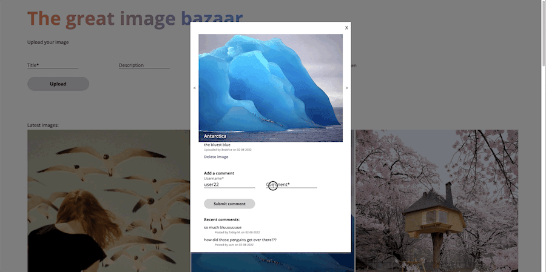

# 📷 The Great Image Bazaar - Instagram-like SPA

## Overview

Instagram-like SPA allowing any user to upload, view, comment and delete images.

📱 🖥 Optimized for both mobile & desktop.

❓ This application was made as a Vue.js learning project during the full stack bootcamp at Spiced Academy.

## Features

-   Image upload:

    -   users can upload images (with client-side form validation) including a title and description

-   Comments:

    -   users can comment on images and view all of an image's comments

-   Gallery view with pagination:

    -   the gallery view loads more images whenever users scroll down

-   Single-image view:

    -   users can navigate between single-image views thanks to next/previous buttons

-   New image notification:

    -   users get a notification whenever new images have been uploaded since they opened the webpage; clicking on the notification refreshes the image list with the newly added ones

-   Routing:

    -   when toggling the single-image view, the URL changes dynamically to correspond to the opened image
    -   users can share links that go directly to an individual image
    -   the single-image view also updates when the user clicks on the browser's back/forward history navigation buttons

-   Deleting images:

    -   users can delete any images; this also deletes all comments for that image

## Technology

-   Javascript
-   Vue.js
-   Node.js & Express
-   PostgreSQL
-   AWS S3

## Set up this project locally

-   you need to own an AWS account with an S3 Bucket and pass AWS credentials so the middleware works
-   set up a PSQL database as described in the `images.sql` file in this repo
-   clone the repository
-   install all the dependencies with `npm install`
-   run the project locally with `npm start` and open it at `localhost:8080`

## Previews

### Gallery view + load more on scroll

 

### Uploading an image

 

### Commenting on images

 

### Single image view + routing

 

### New image notification

 
